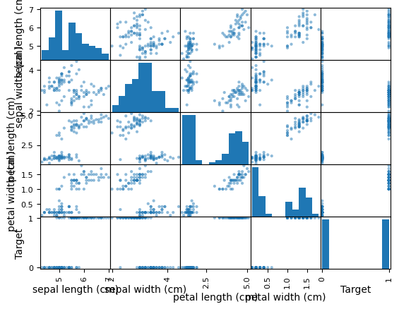
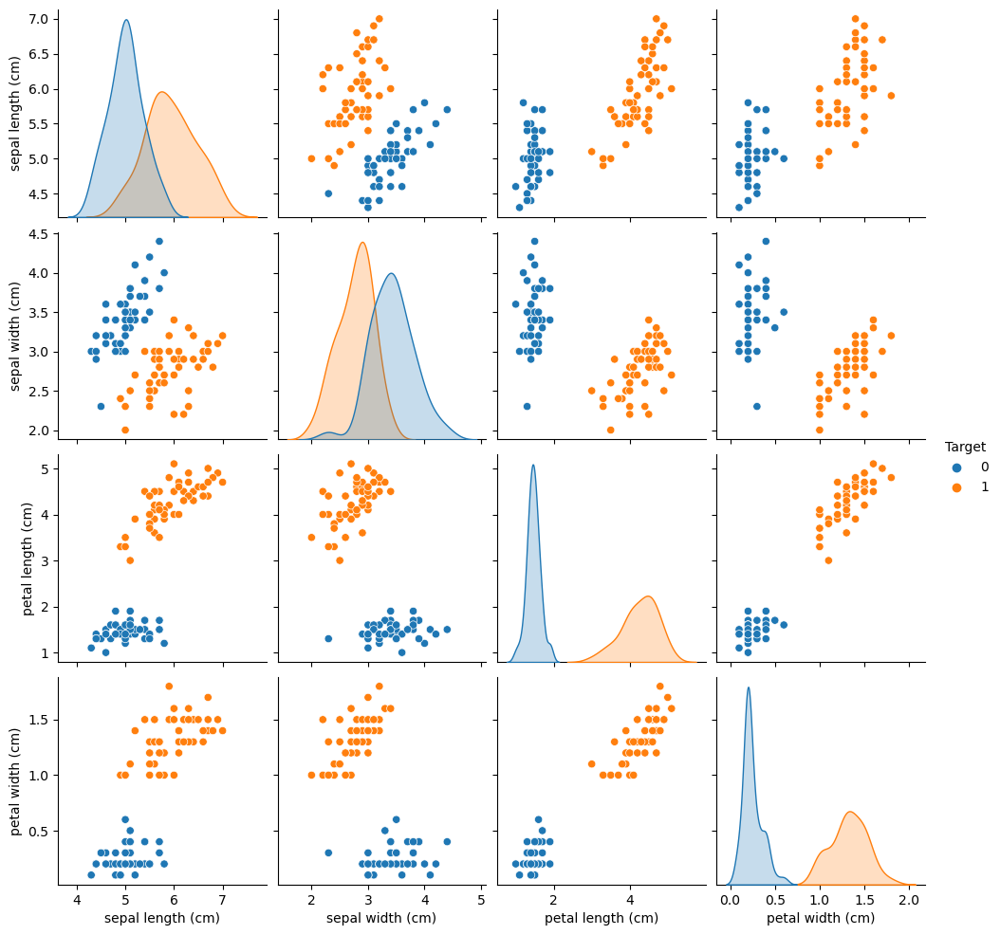
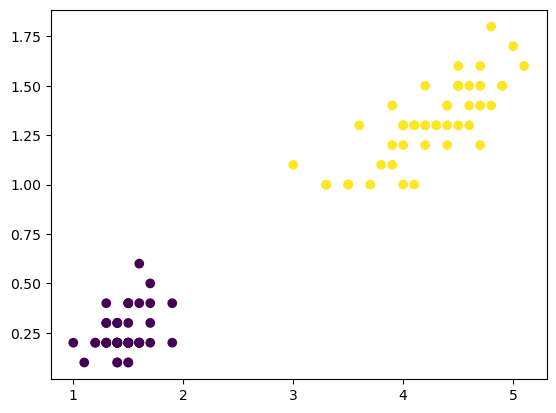
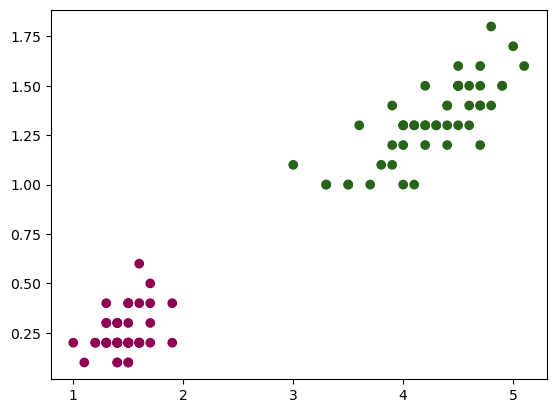
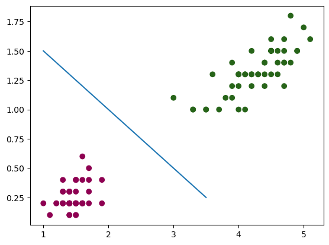
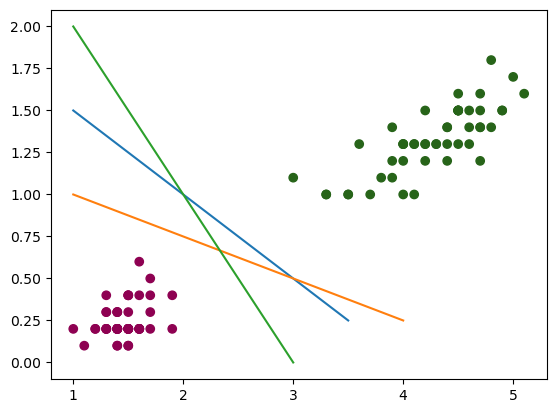
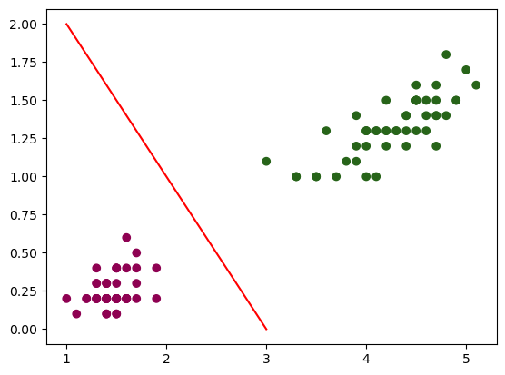
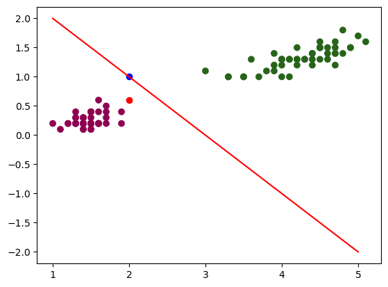
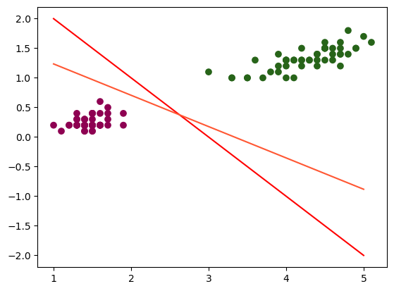
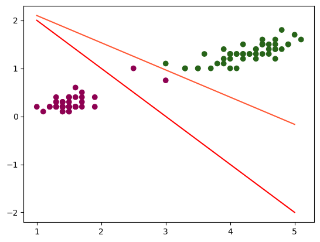

# Aprendizado de máquinas
- Vamos usar o dataset iris, bastante conhecido pra quem já trabalha com Machine Learning
    - https://scikit-learn.org/stable/modules/generated/sklearn.datasets.load_iris.html#sklearn.datasets.load_iris


```python
# Importando as bibliotecas (pandas, matplotlib, numpy)
import pandas as pd
import numpy as np
import matplotlib.pyplot as plt 
```


```python
# Importando o dataset iris
from sklearn.datasets import load_iris
```


```python
# Obtendo os dados do dataset
data = load_iris()
```


```python
data
```


    {'data': array([[5.1, 3.5, 1.4, 0.2],
            [4.9, 3. , 1.4, 0.2],
            [4.7, 3.2, 1.3, 0.2],
            [4.6, 3.1, 1.5, 0.2],
            [5. , 3.6, 1.4, 0.2],
            [5.4, 3.9, 1.7, 0.4],
            [4.6, 3.4, 1.4, 0.3],
            [5. , 3.4, 1.5, 0.2],
            [4.4, 2.9, 1.4, 0.2],
            [4.9, 3.1, 1.5, 0.1],
            [5.4, 3.7, 1.5, 0.2],
            [4.8, 3.4, 1.6, 0.2],
            [4.8, 3. , 1.4, 0.1],
            [4.3, 3. , 1.1, 0.1],
            [5.8, 4. , 1.2, 0.2],
            [5.7, 4.4, 1.5, 0.4],
            [5.4, 3.9, 1.3, 0.4],
            [5.1, 3.5, 1.4, 0.3],
            [5.7, 3.8, 1.7, 0.3],
            [5.1, 3.8, 1.5, 0.3],
            [5.4, 3.4, 1.7, 0.2],
            [5.1, 3.7, 1.5, 0.4],
            [4.6, 3.6, 1. , 0.2],
            [5.1, 3.3, 1.7, 0.5],
            [4.8, 3.4, 1.9, 0.2],
            [5. , 3. , 1.6, 0.2],
            [5. , 3.4, 1.6, 0.4],
            [5.2, 3.5, 1.5, 0.2],
            [5.2, 3.4, 1.4, 0.2],
            [4.7, 3.2, 1.6, 0.2],
            [4.8, 3.1, 1.6, 0.2],
            [5.4, 3.4, 1.5, 0.4],
            [5.2, 4.1, 1.5, 0.1],
            [5.5, 4.2, 1.4, 0.2],
            [4.9, 3.1, 1.5, 0.2],
            [5. , 3.2, 1.2, 0.2],
            [5.5, 3.5, 1.3, 0.2],
            [4.9, 3.6, 1.4, 0.1],
            [4.4, 3. , 1.3, 0.2],
            [5.1, 3.4, 1.5, 0.2],
            [5. , 3.5, 1.3, 0.3],
            [4.5, 2.3, 1.3, 0.3],
            [4.4, 3.2, 1.3, 0.2],
            [5. , 3.5, 1.6, 0.6],
            [5.1, 3.8, 1.9, 0.4],
            [4.8, 3. , 1.4, 0.3],
            [5.1, 3.8, 1.6, 0.2],
            [4.6, 3.2, 1.4, 0.2],
            [5.3, 3.7, 1.5, 0.2],
            [5. , 3.3, 1.4, 0.2],
            [7. , 3.2, 4.7, 1.4],
            [6.4, 3.2, 4.5, 1.5],
            [6.9, 3.1, 4.9, 1.5],
            [5.5, 2.3, 4. , 1.3],
            [6.5, 2.8, 4.6, 1.5],
            [5.7, 2.8, 4.5, 1.3],
            [6.3, 3.3, 4.7, 1.6],
            [4.9, 2.4, 3.3, 1. ],
            [6.6, 2.9, 4.6, 1.3],
            [5.2, 2.7, 3.9, 1.4],
            [5. , 2. , 3.5, 1. ],
            [5.9, 3. , 4.2, 1.5],
            [6. , 2.2, 4. , 1. ],
            [6.1, 2.9, 4.7, 1.4],
            [5.6, 2.9, 3.6, 1.3],
            [6.7, 3.1, 4.4, 1.4],
            [5.6, 3. , 4.5, 1.5],
            [5.8, 2.7, 4.1, 1. ],
            [6.2, 2.2, 4.5, 1.5],
            [5.6, 2.5, 3.9, 1.1],
            [5.9, 3.2, 4.8, 1.8],
            [6.1, 2.8, 4. , 1.3],
            [6.3, 2.5, 4.9, 1.5],
            [6.1, 2.8, 4.7, 1.2],
            [6.4, 2.9, 4.3, 1.3],
            [6.6, 3. , 4.4, 1.4],
            [6.8, 2.8, 4.8, 1.4],
            [6.7, 3. , 5. , 1.7],
            [6. , 2.9, 4.5, 1.5],
            [5.7, 2.6, 3.5, 1. ],
            [5.5, 2.4, 3.8, 1.1],
            [5.5, 2.4, 3.7, 1. ],
            [5.8, 2.7, 3.9, 1.2],
            [6. , 2.7, 5.1, 1.6],
            [5.4, 3. , 4.5, 1.5],
            [6. , 3.4, 4.5, 1.6],
            [6.7, 3.1, 4.7, 1.5],
            [6.3, 2.3, 4.4, 1.3],
            [5.6, 3. , 4.1, 1.3],
            [5.5, 2.5, 4. , 1.3],
            [5.5, 2.6, 4.4, 1.2],
            [6.1, 3. , 4.6, 1.4],
            [5.8, 2.6, 4. , 1.2],
            [5. , 2.3, 3.3, 1. ],
            [5.6, 2.7, 4.2, 1.3],
            [5.7, 3. , 4.2, 1.2],
            [5.7, 2.9, 4.2, 1.3],
            [6.2, 2.9, 4.3, 1.3],
            [5.1, 2.5, 3. , 1.1],
            [5.7, 2.8, 4.1, 1.3],
            [6.3, 3.3, 6. , 2.5],
            [5.8, 2.7, 5.1, 1.9],
            [7.1, 3. , 5.9, 2.1],
            [6.3, 2.9, 5.6, 1.8],
            [6.5, 3. , 5.8, 2.2],
            [7.6, 3. , 6.6, 2.1],
            [4.9, 2.5, 4.5, 1.7],
            [7.3, 2.9, 6.3, 1.8],
            [6.7, 2.5, 5.8, 1.8],
            [7.2, 3.6, 6.1, 2.5],
            [6.5, 3.2, 5.1, 2. ],
            [6.4, 2.7, 5.3, 1.9],
            [6.8, 3. , 5.5, 2.1],
            [5.7, 2.5, 5. , 2. ],
            [5.8, 2.8, 5.1, 2.4],
            [6.4, 3.2, 5.3, 2.3],
            [6.5, 3. , 5.5, 1.8],
            [7.7, 3.8, 6.7, 2.2],
            [7.7, 2.6, 6.9, 2.3],
            [6. , 2.2, 5. , 1.5],
            [6.9, 3.2, 5.7, 2.3],
            [5.6, 2.8, 4.9, 2. ],
            [7.7, 2.8, 6.7, 2. ],
            [6.3, 2.7, 4.9, 1.8],
            [6.7, 3.3, 5.7, 2.1],
            [7.2, 3.2, 6. , 1.8],
            [6.2, 2.8, 4.8, 1.8],
            [6.1, 3. , 4.9, 1.8],
            [6.4, 2.8, 5.6, 2.1],
            [7.2, 3. , 5.8, 1.6],
            [7.4, 2.8, 6.1, 1.9],
            [7.9, 3.8, 6.4, 2. ],
            [6.4, 2.8, 5.6, 2.2],
            [6.3, 2.8, 5.1, 1.5],
            [6.1, 2.6, 5.6, 1.4],
            [7.7, 3. , 6.1, 2.3],
            [6.3, 3.4, 5.6, 2.4],
            [6.4, 3.1, 5.5, 1.8],
            [6. , 3. , 4.8, 1.8],
            [6.9, 3.1, 5.4, 2.1],
            [6.7, 3.1, 5.6, 2.4],
            [6.9, 3.1, 5.1, 2.3],
            [5.8, 2.7, 5.1, 1.9],
            [6.8, 3.2, 5.9, 2.3],
            [6.7, 3.3, 5.7, 2.5],
            [6.7, 3. , 5.2, 2.3],
            [6.3, 2.5, 5. , 1.9],
            [6.5, 3. , 5.2, 2. ],
            [6.2, 3.4, 5.4, 2.3],
            [5.9, 3. , 5.1, 1.8]]),
     'target': array([0, 0, 0, 0, 0, 0, 0, 0, 0, 0, 0, 0, 0, 0, 0, 0, 0, 0, 0, 0, 0, 0,
            0, 0, 0, 0, 0, 0, 0, 0, 0, 0, 0, 0, 0, 0, 0, 0, 0, 0, 0, 0, 0, 0,
            0, 0, 0, 0, 0, 0, 1, 1, 1, 1, 1, 1, 1, 1, 1, 1, 1, 1, 1, 1, 1, 1,
            1, 1, 1, 1, 1, 1, 1, 1, 1, 1, 1, 1, 1, 1, 1, 1, 1, 1, 1, 1, 1, 1,
            1, 1, 1, 1, 1, 1, 1, 1, 1, 1, 1, 1, 2, 2, 2, 2, 2, 2, 2, 2, 2, 2,
            2, 2, 2, 2, 2, 2, 2, 2, 2, 2, 2, 2, 2, 2, 2, 2, 2, 2, 2, 2, 2, 2,
            2, 2, 2, 2, 2, 2, 2, 2, 2, 2, 2, 2, 2, 2, 2, 2, 2, 2]),
     'frame': None,
     'target_names': array(['setosa', 'versicolor', 'virginica'], dtype='<U10'),
     'DESCR': '.. _iris_dataset:\n\nIris plants dataset\n--------------------\n\n**Data Set Characteristics:**\n\n    :Number of Instances: 150 (50 in each of three classes)\n    :Number of Attributes: 4 numeric, predictive attributes and the class\n    :Attribute Information:\n        - sepal length in cm\n        - sepal width in cm\n        - petal length in cm\n        - petal width in cm\n        - class:\n                - Iris-Setosa\n                - Iris-Versicolour\n                - Iris-Virginica\n                \n    :Summary Statistics:\n\n    ============== ==== ==== ======= ===== ====================\n                    Min  Max   Mean    SD   Class Correlation\n    ============== ==== ==== ======= ===== ====================\n    sepal length:   4.3  7.9   5.84   0.83    0.7826\n    sepal width:    2.0  4.4   3.05   0.43   -0.4194\n    petal length:   1.0  6.9   3.76   1.76    0.9490  (high!)\n    petal width:    0.1  2.5   1.20   0.76    0.9565  (high!)\n    ============== ==== ==== ======= ===== ====================\n\n    :Missing Attribute Values: None\n    :Class Distribution: 33.3% for each of 3 classes.\n    :Creator: R.A. Fisher\n    :Donor: Michael Marshall (MARSHALL%PLU@io.arc.nasa.gov)\n    :Date: July, 1988\n\nThe famous Iris database, first used by Sir R.A. Fisher. The dataset is taken\nfrom Fisher\'s paper. Note that it\'s the same as in R, but not as in the UCI\nMachine Learning Repository, which has two wrong data points.\n\nThis is perhaps the best known database to be found in the\npattern recognition literature.  Fisher\'s paper is a classic in the field and\nis referenced frequently to this day.  (See Duda & Hart, for example.)  The\ndata set contains 3 classes of 50 instances each, where each class refers to a\ntype of iris plant.  One class is linearly separable from the other 2; the\nlatter are NOT linearly separable from each other.\n\n.. topic:: References\n\n   - Fisher, R.A. "The use of multiple measurements in taxonomic problems"\n     Annual Eugenics, 7, Part II, 179-188 (1936); also in "Contributions to\n     Mathematical Statistics" (John Wiley, NY, 1950).\n   - Duda, R.O., & Hart, P.E. (1973) Pattern Classification and Scene Analysis.\n     (Q327.D83) John Wiley & Sons.  ISBN 0-471-22361-1.  See page 218.\n   - Dasarathy, B.V. (1980) "Nosing Around the Neighborhood: A New System\n     Structure and Classification Rule for Recognition in Partially Exposed\n     Environments".  IEEE Transactions on Pattern Analysis and Machine\n     Intelligence, Vol. PAMI-2, No. 1, 67-71.\n   - Gates, G.W. (1972) "The Reduced Nearest Neighbor Rule".  IEEE Transactions\n     on Information Theory, May 1972, 431-433.\n   - See also: 1988 MLC Proceedings, 54-64.  Cheeseman et al"s AUTOCLASS II\n     conceptual clustering system finds 3 classes in the data.\n   - Many, many more ...',
     'feature_names': ['sepal length (cm)',
      'sepal width (cm)',
      'petal length (cm)',
      'petal width (cm)'],
     'filename': 'iris.csv',
     'data_module': 'sklearn.datasets.data'}


```python
# Valores de X
data.data
```


    array([[5.1, 3.5, 1.4, 0.2],
           [4.9, 3. , 1.4, 0.2],
           [4.7, 3.2, 1.3, 0.2],
           [4.6, 3.1, 1.5, 0.2],
           [5. , 3.6, 1.4, 0.2],
           [5.4, 3.9, 1.7, 0.4],
           [4.6, 3.4, 1.4, 0.3],
           [5. , 3.4, 1.5, 0.2],
           [4.4, 2.9, 1.4, 0.2],
           [4.9, 3.1, 1.5, 0.1],
           [5.4, 3.7, 1.5, 0.2],
           [4.8, 3.4, 1.6, 0.2],
           [4.8, 3. , 1.4, 0.1],
           [4.3, 3. , 1.1, 0.1],
           [5.8, 4. , 1.2, 0.2],
           [5.7, 4.4, 1.5, 0.4],
           [5.4, 3.9, 1.3, 0.4],
           [5.1, 3.5, 1.4, 0.3],
           [5.7, 3.8, 1.7, 0.3],
           [5.1, 3.8, 1.5, 0.3],
           [5.4, 3.4, 1.7, 0.2],
           [5.1, 3.7, 1.5, 0.4],
           [4.6, 3.6, 1. , 0.2],
           [5.1, 3.3, 1.7, 0.5],
           [4.8, 3.4, 1.9, 0.2],
           [5. , 3. , 1.6, 0.2],
           [5. , 3.4, 1.6, 0.4],
           [5.2, 3.5, 1.5, 0.2],
           [5.2, 3.4, 1.4, 0.2],
           [4.7, 3.2, 1.6, 0.2],
           [4.8, 3.1, 1.6, 0.2],
           [5.4, 3.4, 1.5, 0.4],
           [5.2, 4.1, 1.5, 0.1],
           [5.5, 4.2, 1.4, 0.2],
           [4.9, 3.1, 1.5, 0.2],
           [5. , 3.2, 1.2, 0.2],
           [5.5, 3.5, 1.3, 0.2],
           [4.9, 3.6, 1.4, 0.1],
           [4.4, 3. , 1.3, 0.2],
           [5.1, 3.4, 1.5, 0.2],
           [5. , 3.5, 1.3, 0.3],
           [4.5, 2.3, 1.3, 0.3],
           [4.4, 3.2, 1.3, 0.2],
           [5. , 3.5, 1.6, 0.6],
           [5.1, 3.8, 1.9, 0.4],
           [4.8, 3. , 1.4, 0.3],
           [5.1, 3.8, 1.6, 0.2],
           [4.6, 3.2, 1.4, 0.2],
           [5.3, 3.7, 1.5, 0.2],
           [5. , 3.3, 1.4, 0.2],
           [7. , 3.2, 4.7, 1.4],
           [6.4, 3.2, 4.5, 1.5],
           [6.9, 3.1, 4.9, 1.5],
           [5.5, 2.3, 4. , 1.3],
           [6.5, 2.8, 4.6, 1.5],
           [5.7, 2.8, 4.5, 1.3],
           [6.3, 3.3, 4.7, 1.6],
           [4.9, 2.4, 3.3, 1. ],
           [6.6, 2.9, 4.6, 1.3],
           [5.2, 2.7, 3.9, 1.4],
           [5. , 2. , 3.5, 1. ],
           [5.9, 3. , 4.2, 1.5],
           [6. , 2.2, 4. , 1. ],
           [6.1, 2.9, 4.7, 1.4],
           [5.6, 2.9, 3.6, 1.3],
           [6.7, 3.1, 4.4, 1.4],
           [5.6, 3. , 4.5, 1.5],
           [5.8, 2.7, 4.1, 1. ],
           [6.2, 2.2, 4.5, 1.5],
           [5.6, 2.5, 3.9, 1.1],
           [5.9, 3.2, 4.8, 1.8],
           [6.1, 2.8, 4. , 1.3],
           [6.3, 2.5, 4.9, 1.5],
           [6.1, 2.8, 4.7, 1.2],
           [6.4, 2.9, 4.3, 1.3],
           [6.6, 3. , 4.4, 1.4],
           [6.8, 2.8, 4.8, 1.4],
           [6.7, 3. , 5. , 1.7],
           [6. , 2.9, 4.5, 1.5],
           [5.7, 2.6, 3.5, 1. ],
           [5.5, 2.4, 3.8, 1.1],
           [5.5, 2.4, 3.7, 1. ],
           [5.8, 2.7, 3.9, 1.2],
           [6. , 2.7, 5.1, 1.6],
           [5.4, 3. , 4.5, 1.5],
           [6. , 3.4, 4.5, 1.6],
           [6.7, 3.1, 4.7, 1.5],
           [6.3, 2.3, 4.4, 1.3],
           [5.6, 3. , 4.1, 1.3],
           [5.5, 2.5, 4. , 1.3],
           [5.5, 2.6, 4.4, 1.2],
           [6.1, 3. , 4.6, 1.4],
           [5.8, 2.6, 4. , 1.2],
           [5. , 2.3, 3.3, 1. ],
           [5.6, 2.7, 4.2, 1.3],
           [5.7, 3. , 4.2, 1.2],
           [5.7, 2.9, 4.2, 1.3],
           [6.2, 2.9, 4.3, 1.3],
           [5.1, 2.5, 3. , 1.1],
           [5.7, 2.8, 4.1, 1.3],
           [6.3, 3.3, 6. , 2.5],
           [5.8, 2.7, 5.1, 1.9],
           [7.1, 3. , 5.9, 2.1],
           [6.3, 2.9, 5.6, 1.8],
           [6.5, 3. , 5.8, 2.2],
           [7.6, 3. , 6.6, 2.1],
           [4.9, 2.5, 4.5, 1.7],
           [7.3, 2.9, 6.3, 1.8],
           [6.7, 2.5, 5.8, 1.8],
           [7.2, 3.6, 6.1, 2.5],
           [6.5, 3.2, 5.1, 2. ],
           [6.4, 2.7, 5.3, 1.9],
           [6.8, 3. , 5.5, 2.1],
           [5.7, 2.5, 5. , 2. ],
           [5.8, 2.8, 5.1, 2.4],
           [6.4, 3.2, 5.3, 2.3],
           [6.5, 3. , 5.5, 1.8],
           [7.7, 3.8, 6.7, 2.2],
           [7.7, 2.6, 6.9, 2.3],
           [6. , 2.2, 5. , 1.5],
           [6.9, 3.2, 5.7, 2.3],
           [5.6, 2.8, 4.9, 2. ],
           [7.7, 2.8, 6.7, 2. ],
           [6.3, 2.7, 4.9, 1.8],
           [6.7, 3.3, 5.7, 2.1],
           [7.2, 3.2, 6. , 1.8],
           [6.2, 2.8, 4.8, 1.8],
           [6.1, 3. , 4.9, 1.8],
           [6.4, 2.8, 5.6, 2.1],
           [7.2, 3. , 5.8, 1.6],
           [7.4, 2.8, 6.1, 1.9],
           [7.9, 3.8, 6.4, 2. ],
           [6.4, 2.8, 5.6, 2.2],
           [6.3, 2.8, 5.1, 1.5],
           [6.1, 2.6, 5.6, 1.4],
           [7.7, 3. , 6.1, 2.3],
           [6.3, 3.4, 5.6, 2.4],
           [6.4, 3.1, 5.5, 1.8],
           [6. , 3. , 4.8, 1.8],
           [6.9, 3.1, 5.4, 2.1],
           [6.7, 3.1, 5.6, 2.4],
           [6.9, 3.1, 5.1, 2.3],
           [5.8, 2.7, 5.1, 1.9],
           [6.8, 3.2, 5.9, 2.3],
           [6.7, 3.3, 5.7, 2.5],
           [6.7, 3. , 5.2, 2.3],
           [6.3, 2.5, 5. , 1.9],
           [6.5, 3. , 5.2, 2. ],
           [6.2, 3.4, 5.4, 2.3],
           [5.9, 3. , 5.1, 1.8]])


```python
# Valores de Y
data.target
```


    array([0, 0, 0, 0, 0, 0, 0, 0, 0, 0, 0, 0, 0, 0, 0, 0, 0, 0, 0, 0, 0, 0,
           0, 0, 0, 0, 0, 0, 0, 0, 0, 0, 0, 0, 0, 0, 0, 0, 0, 0, 0, 0, 0, 0,
           0, 0, 0, 0, 0, 0, 1, 1, 1, 1, 1, 1, 1, 1, 1, 1, 1, 1, 1, 1, 1, 1,
           1, 1, 1, 1, 1, 1, 1, 1, 1, 1, 1, 1, 1, 1, 1, 1, 1, 1, 1, 1, 1, 1,
           1, 1, 1, 1, 1, 1, 1, 1, 1, 1, 1, 1, 2, 2, 2, 2, 2, 2, 2, 2, 2, 2,
           2, 2, 2, 2, 2, 2, 2, 2, 2, 2, 2, 2, 2, 2, 2, 2, 2, 2, 2, 2, 2, 2,
           2, 2, 2, 2, 2, 2, 2, 2, 2, 2, 2, 2, 2, 2, 2, 2, 2, 2])


**Podemos transformar essa base em um DataFrame para conseguir trabalhar melhor com os dados**


```python
# Transformando em um DataFrame
iris = pd.DataFrame(data.data)
iris.head()
```


<div>
<style scoped>
    .dataframe tbody tr th:only-of-type {
        vertical-align: middle;
    }

    .dataframe tbody tr th {
        vertical-align: top;
    }

    .dataframe thead th {
        text-align: right;
    }
</style>
<table border="1" class="dataframe">
  <thead>
    <tr style="text-align: right;">
      <th></th>
      <th>0</th>
      <th>1</th>
      <th>2</th>
      <th>3</th>
    </tr>
  </thead>
  <tbody>
    <tr>
      <th>0</th>
      <td>5.1</td>
      <td>3.5</td>
      <td>1.4</td>
      <td>0.2</td>
    </tr>
    <tr>
      <th>1</th>
      <td>4.9</td>
      <td>3.0</td>
      <td>1.4</td>
      <td>0.2</td>
    </tr>
    <tr>
      <th>2</th>
      <td>4.7</td>
      <td>3.2</td>
      <td>1.3</td>
      <td>0.2</td>
    </tr>
    <tr>
      <th>3</th>
      <td>4.6</td>
      <td>3.1</td>
      <td>1.5</td>
      <td>0.2</td>
    </tr>
    <tr>
      <th>4</th>
      <td>5.0</td>
      <td>3.6</td>
      <td>1.4</td>
      <td>0.2</td>
    </tr>
  </tbody>
</table>
</div>


**O que são as colunas 0, 1, 2, 3? No próprio dataset existe o `feature_names` que podemos usar para atribuir nome as colunas**


```python
# Nome das colunas
iris.columns = data.feature_names
iris.head()
```


<div>
<style scoped>
    .dataframe tbody tr th:only-of-type {
        vertical-align: middle;
    }

    .dataframe tbody tr th {
        vertical-align: top;
    }

    .dataframe thead th {
        text-align: right;
    }
</style>
<table border="1" class="dataframe">
  <thead>
    <tr style="text-align: right;">
      <th></th>
      <th>sepal length (cm)</th>
      <th>sepal width (cm)</th>
      <th>petal length (cm)</th>
      <th>petal width (cm)</th>
    </tr>
  </thead>
  <tbody>
    <tr>
      <th>0</th>
      <td>5.1</td>
      <td>3.5</td>
      <td>1.4</td>
      <td>0.2</td>
    </tr>
    <tr>
      <th>1</th>
      <td>4.9</td>
      <td>3.0</td>
      <td>1.4</td>
      <td>0.2</td>
    </tr>
    <tr>
      <th>2</th>
      <td>4.7</td>
      <td>3.2</td>
      <td>1.3</td>
      <td>0.2</td>
    </tr>
    <tr>
      <th>3</th>
      <td>4.6</td>
      <td>3.1</td>
      <td>1.5</td>
      <td>0.2</td>
    </tr>
    <tr>
      <th>4</th>
      <td>5.0</td>
      <td>3.6</td>
      <td>1.4</td>
      <td>0.2</td>
    </tr>
  </tbody>
</table>
</div>


**Também podemos adicionar a coluna `Target` com a classificação de cada linha**


```python
# Adicionando a coluna targer ao DataFrame
iris['Target'] = data.target
iris.head()
```


<div>
<style scoped>
    .dataframe tbody tr th:only-of-type {
        vertical-align: middle;
    }

    .dataframe tbody tr th {
        vertical-align: top;
    }

    .dataframe thead th {
        text-align: right;
    }
</style>
<table border="1" class="dataframe">
  <thead>
    <tr style="text-align: right;">
      <th></th>
      <th>sepal length (cm)</th>
      <th>sepal width (cm)</th>
      <th>petal length (cm)</th>
      <th>petal width (cm)</th>
      <th>Target</th>
    </tr>
  </thead>
  <tbody>
    <tr>
      <th>0</th>
      <td>5.1</td>
      <td>3.5</td>
      <td>1.4</td>
      <td>0.2</td>
      <td>0</td>
    </tr>
    <tr>
      <th>1</th>
      <td>4.9</td>
      <td>3.0</td>
      <td>1.4</td>
      <td>0.2</td>
      <td>0</td>
    </tr>
    <tr>
      <th>2</th>
      <td>4.7</td>
      <td>3.2</td>
      <td>1.3</td>
      <td>0.2</td>
      <td>0</td>
    </tr>
    <tr>
      <th>3</th>
      <td>4.6</td>
      <td>3.1</td>
      <td>1.5</td>
      <td>0.2</td>
      <td>0</td>
    </tr>
    <tr>
      <th>4</th>
      <td>5.0</td>
      <td>3.6</td>
      <td>1.4</td>
      <td>0.2</td>
      <td>0</td>
    </tr>
  </tbody>
</table>
</div>


```python
iris.info()
```

    <class 'pandas.core.frame.DataFrame'>
    Int64Index: 102 entries, 0 to 1
    Data columns (total 5 columns):
     #   Column             Non-Null Count  Dtype  
    ---  ------             --------------  -----  
     0   sepal length (cm)  102 non-null    float64
     1   sepal width (cm)   102 non-null    float64
     2   petal length (cm)  102 non-null    float64
     3   petal width (cm)   102 non-null    float64
     4   Target             102 non-null    int64  
    dtypes: float64(4), int64(1)
    memory usage: 4.8 KB
    

**Nesse exemplo, para começarmos a trabalhar com Machine Learning, vamos considerar apenas o Target = 0 e Target = 1**


```python
# Contando a quantidade de cada um dos Targets
iris['Target'].value_counts()
```


    0    50
    1    50
    2    50
    Name: Target, dtype: int64


```python
# Retirando Target = 2
iris = iris[iris.Target != 2]
```


```python
# Contando novamente os valores
iris['Target'].value_counts()
```


    0    50
    1    50
    Name: Target, dtype: int64


# Criando uma função para separar esses dados


```python
iris.head()
```


<div>
<style scoped>
    .dataframe tbody tr th:only-of-type {
        vertical-align: middle;
    }

    .dataframe tbody tr th {
        vertical-align: top;
    }

    .dataframe thead th {
        text-align: right;
    }
</style>
<table border="1" class="dataframe">
  <thead>
    <tr style="text-align: right;">
      <th></th>
      <th>sepal length (cm)</th>
      <th>sepal width (cm)</th>
      <th>petal length (cm)</th>
      <th>petal width (cm)</th>
      <th>Target</th>
    </tr>
  </thead>
  <tbody>
    <tr>
      <th>0</th>
      <td>5.1</td>
      <td>3.5</td>
      <td>1.4</td>
      <td>0.2</td>
      <td>0</td>
    </tr>
    <tr>
      <th>1</th>
      <td>4.9</td>
      <td>3.0</td>
      <td>1.4</td>
      <td>0.2</td>
      <td>0</td>
    </tr>
    <tr>
      <th>2</th>
      <td>4.7</td>
      <td>3.2</td>
      <td>1.3</td>
      <td>0.2</td>
      <td>0</td>
    </tr>
    <tr>
      <th>3</th>
      <td>4.6</td>
      <td>3.1</td>
      <td>1.5</td>
      <td>0.2</td>
      <td>0</td>
    </tr>
    <tr>
      <th>4</th>
      <td>5.0</td>
      <td>3.6</td>
      <td>1.4</td>
      <td>0.2</td>
      <td>0</td>
    </tr>
  </tbody>
</table>
</div>


**Vamos começar visualizando esses dados 2 a 2**
- Podemos usar o `.plotting.scatter_matrix()` do pandas para gerar essa visualização


```python
pd.plotting.scatter_matrix(iris);
```


    

    


**Porém também podemos usar o seaborn para tornar o visual mais amigável**
- Do seaborn, podemos usar o `.pairplot()`
    - Usando o parâmetro `hue` podemos escolher qual coluna vai definir a cor dos nossos dados


```python
import seaborn as sns
sns.pairplot(iris,hue="Target");
```


    

    


**Conseguimos facilmente traçar uma reta que separaria petal lenght de petal width**<br><br>
**Antes disso, vamos plotar um gráfico com essas informações**


```python
# Traçando um scatter doo matplotlib das colunas "petal length (cm)" e "petal width (cm)"
fig, ax = plt.subplots()

x = iris["petal length (cm)"]
y = iris["petal width (cm)"]

ax.scatter(x,y,c=iris.Target)

plt.show()
```


    

    


**Para melhorar a visualização, podemos usar o colormap**
- https://matplotlib.org/3.5.0/tutorials/colors/colormaps.html
    - `cmap='PiYG'`


```python
# Traçando um scatter do matplotlib das colunas "petal length (cm)" e "petal width (cm)"
fig, ax = plt.subplots()

x = iris["petal length (cm)"]
y = iris["petal width (cm)"]

ax.scatter(x,y,c=iris.Target,cmap='PiYG')

plt.show()
```


    

    


# Podemos traçar uma reta capaz de separar esses dados

**Vamos traçar qualquer reta que irá conseguir separar os 2 dados**


```python
# Traçando o scatter plot e a reta
fig, ax = plt.subplots()

# Aqui estamos fazendo um gráfico de dispersão
x = iris["petal length (cm)"]
y = iris["petal width (cm)"]
ax.scatter(x,y,c=iris.Target,cmap='PiYG')

# Aqui estamos fazendo um gráfico de linha
x_reta = [1,3.5]
y_reta = [1.5,0.25]
ax.plot(x_reta,y_reta)

plt.show()
```


    

    


## <font color="blue">Essa é a melhor reta que separa esses dados?</font>
- <font color="red"> **Provavelmente não, mas ela consegue resolver o nosso problema** </font>

**Porém podemos traçar outras retas que também conseguem fazer isso**


```python
# Buscando por melhores retas
fig, ax = plt.subplots()

# Aqui estamos fazendo um gráfico de dispersão
x = iris["petal length (cm)"]
y = iris["petal width (cm)"]
ax.scatter(x,y,c=iris.Target,cmap='PiYG')

# Aqui estamos fazendo um gráfico de linha
x_reta = [1,3.5]
y_reta = [1.5,0.25]
ax.plot(x_reta,y_reta)

# Aqui estamos fazendo um gráfico de linha
x_reta2 = [1,4]
y_reta2 = [1,0.25]
ax.plot(x_reta2,y_reta2)

# Aqui estamos fazendo um gráfico de linha
x_reta3 = [1,3]
y_reta3 = [2,0]
ax.plot(x_reta3,y_reta3)

plt.show()
```


    

    


```python
# Buscando por melhores retas
fig, ax = plt.subplots()

# Aqui estamos fazendo um gráfico de dispersão
x = iris["petal length (cm)"]
y = iris["petal width (cm)"]
ax.scatter(x,y,c=iris.Target,cmap='PiYG')

# Aqui estamos fazendo um gráfico de linha
x_reta3 = [1,3]
y_reta3 = [2,0]
ax.plot(x_reta3,y_reta3,c='r')

plt.show()
```


    

    


**Qualquer uma das retas serviria para o nosso modelo já que elas separam os dados (lembre-se que na maioria dos casos não vamos estar falando de apenas 2 dimensões)**
<br><br>
**Podemos escolher a <font color="red"> vermelha </font> pelo fato dela não estar nem muito próxima ao 0 nem muito próxima ao 1**

**Essa reta é dada pela equação abaixo:**<br>
**<font color="red"> y = -x + 3** </font>

**Para determinar em qual região qualquer ponto vai estar, basta substituirmos o x do ponto na equação acima e verificar:**<br><br>
- Se y do ponto > y da equação, esse ponto vai ser classificado como 1
- Se y do ponto < y da equação, esse ponto vai ser classificado como 0

**Ex: (3.5,0.7)**
- y da equação = -x + 3 = -3.5 + 3 = -0.5
- y do ponto = 0.7
<br><br>
- Nesse caso: **`y do ponto > y da equação`** -> **Target = 1**

**Ex: (2,0.6)**
- y da equação = -x + 3 = -2 + 3 = +1
- y do ponto = 0.6
<br><br>
- Nesse caso: **`y do ponto < y da equação`** -> **Target = 0**

**Para visualizar, podemos traçar esse ponto no gráfico acima**


```python
# Traçando novamente a reta e adicionando o ponto que acima
fig, ax = plt.subplots()

# Aqui estamos fazendo um gráfico de dispersão
x = iris["petal length (cm)"]
y = iris["petal width (cm)"]
ax.scatter(x,y,c=iris.Target,cmap='PiYG')

# Aqui estamos fazendo um gráfico de linha
x_reta3 = np.arange(1,6)
y_reta3 = (-1)*x_reta3+3
ax.plot(x_reta3,y_reta3,c='r')

# Fazendo o gráfico de dispersão somente desse ponto
ax.scatter(2,+0.6,c='r')

# Fazendo o gráfico de dispersão somente desse ponto
ax.scatter(2,+1,c='b')

plt.show()
```


    

    


```python
def classifica_modelo(x,y):
    y_equacao = -x + 3 
    y_ponto = y
    
    if y_ponto > y_equacao:
        return 1
    elif y_ponto < y_equacao:
        return 0
    else:
        return -1
```


```python
# (3.5,0.7)
classifica_modelo(3.5,0.7)
```


    1


```python
# (2,0.6)
classifica_modelo(2,0.6)
```


    0


# Criando um modelo de Machine Learning para classificar meus pontos

### Vamos usar o Perceptron para descobrir a melhor reta que separa esses pontos
- https://scikit-learn.org/stable/modules/generated/sklearn.linear_model.Perceptron.html#sklearn.linear_model.Perceptron


```python
# Importando o perceptron
from sklearn.linear_model import Perceptron
clf = Perceptron(tol=1e-3, random_state=0)
```

#### Usando para os nossos dados


```python
iris.head(2)
```


<div>
<style scoped>
    .dataframe tbody tr th:only-of-type {
        vertical-align: middle;
    }

    .dataframe tbody tr th {
        vertical-align: top;
    }

    .dataframe thead th {
        text-align: right;
    }
</style>
<table border="1" class="dataframe">
  <thead>
    <tr style="text-align: right;">
      <th></th>
      <th>sepal length (cm)</th>
      <th>sepal width (cm)</th>
      <th>petal length (cm)</th>
      <th>petal width (cm)</th>
      <th>Target</th>
    </tr>
  </thead>
  <tbody>
    <tr>
      <th>0</th>
      <td>5.1</td>
      <td>3.5</td>
      <td>1.4</td>
      <td>0.2</td>
      <td>0</td>
    </tr>
    <tr>
      <th>1</th>
      <td>4.9</td>
      <td>3.0</td>
      <td>1.4</td>
      <td>0.2</td>
      <td>0</td>
    </tr>
  </tbody>
</table>
</div>


```python
# Selecionando o X e o y
X = iris[['petal length (cm)','petal width (cm)']]
y = iris.Target
```


```python
# Fazendo o fit com o modelo
clf.fit(X, y)
```


<style>#sk-container-id-1 {color: black;background-color: white;}#sk-container-id-1 pre{padding: 0;}#sk-container-id-1 div.sk-toggleable {background-color: white;}#sk-container-id-1 label.sk-toggleable__label {cursor: pointer;display: block;width: 100%;margin-bottom: 0;padding: 0.3em;box-sizing: border-box;text-align: center;}#sk-container-id-1 label.sk-toggleable__label-arrow:before {content: "▸";float: left;margin-right: 0.25em;color: #696969;}#sk-container-id-1 label.sk-toggleable__label-arrow:hover:before {color: black;}#sk-container-id-1 div.sk-estimator:hover label.sk-toggleable__label-arrow:before {color: black;}#sk-container-id-1 div.sk-toggleable__content {max-height: 0;max-width: 0;overflow: hidden;text-align: left;background-color: #f0f8ff;}#sk-container-id-1 div.sk-toggleable__content pre {margin: 0.2em;color: black;border-radius: 0.25em;background-color: #f0f8ff;}#sk-container-id-1 input.sk-toggleable__control:checked~div.sk-toggleable__content {max-height: 200px;max-width: 100%;overflow: auto;}#sk-container-id-1 input.sk-toggleable__control:checked~label.sk-toggleable__label-arrow:before {content: "▾";}#sk-container-id-1 div.sk-estimator input.sk-toggleable__control:checked~label.sk-toggleable__label {background-color: #d4ebff;}#sk-container-id-1 div.sk-label input.sk-toggleable__control:checked~label.sk-toggleable__label {background-color: #d4ebff;}#sk-container-id-1 input.sk-hidden--visually {border: 0;clip: rect(1px 1px 1px 1px);clip: rect(1px, 1px, 1px, 1px);height: 1px;margin: -1px;overflow: hidden;padding: 0;position: absolute;width: 1px;}#sk-container-id-1 div.sk-estimator {font-family: monospace;background-color: #f0f8ff;border: 1px dotted black;border-radius: 0.25em;box-sizing: border-box;margin-bottom: 0.5em;}#sk-container-id-1 div.sk-estimator:hover {background-color: #d4ebff;}#sk-container-id-1 div.sk-parallel-item::after {content: "";width: 100%;border-bottom: 1px solid gray;flex-grow: 1;}#sk-container-id-1 div.sk-label:hover label.sk-toggleable__label {background-color: #d4ebff;}#sk-container-id-1 div.sk-serial::before {content: "";position: absolute;border-left: 1px solid gray;box-sizing: border-box;top: 0;bottom: 0;left: 50%;z-index: 0;}#sk-container-id-1 div.sk-serial {display: flex;flex-direction: column;align-items: center;background-color: white;padding-right: 0.2em;padding-left: 0.2em;position: relative;}#sk-container-id-1 div.sk-item {position: relative;z-index: 1;}#sk-container-id-1 div.sk-parallel {display: flex;align-items: stretch;justify-content: center;background-color: white;position: relative;}#sk-container-id-1 div.sk-item::before, #sk-container-id-1 div.sk-parallel-item::before {content: "";position: absolute;border-left: 1px solid gray;box-sizing: border-box;top: 0;bottom: 0;left: 50%;z-index: -1;}#sk-container-id-1 div.sk-parallel-item {display: flex;flex-direction: column;z-index: 1;position: relative;background-color: white;}#sk-container-id-1 div.sk-parallel-item:first-child::after {align-self: flex-end;width: 50%;}#sk-container-id-1 div.sk-parallel-item:last-child::after {align-self: flex-start;width: 50%;}#sk-container-id-1 div.sk-parallel-item:only-child::after {width: 0;}#sk-container-id-1 div.sk-dashed-wrapped {border: 1px dashed gray;margin: 0 0.4em 0.5em 0.4em;box-sizing: border-box;padding-bottom: 0.4em;background-color: white;}#sk-container-id-1 div.sk-label label {font-family: monospace;font-weight: bold;display: inline-block;line-height: 1.2em;}#sk-container-id-1 div.sk-label-container {text-align: center;}#sk-container-id-1 div.sk-container {/* jupyter's `normalize.less` sets `[hidden] { display: none; }` but bootstrap.min.css set `[hidden] { display: none !important; }` so we also need the `!important` here to be able to override the default hidden behavior on the sphinx rendered scikit-learn.org. See: https://github.com/scikit-learn/scikit-learn/issues/21755 */display: inline-block !important;position: relative;}#sk-container-id-1 div.sk-text-repr-fallback {display: none;}</style><div id="sk-container-id-1" class="sk-top-container"><div class="sk-text-repr-fallback"><pre>Perceptron()</pre><b>In a Jupyter environment, please rerun this cell to show the HTML representation or trust the notebook. <br />On GitHub, the HTML representation is unable to render, please try loading this page with nbviewer.org.</b></div><div class="sk-container" hidden><div class="sk-item"><div class="sk-estimator sk-toggleable"><input class="sk-toggleable__control sk-hidden--visually" id="sk-estimator-id-1" type="checkbox" checked><label for="sk-estimator-id-1" class="sk-toggleable__label sk-toggleable__label-arrow">Perceptron</label><div class="sk-toggleable__content"><pre>Perceptron()</pre></div></div></div></div></div>


```python
# w1 e w2
clf.coef_
```


    array([[0.9, 1.7]])


```python
# w0
clf.intercept_
```


    array([-3.])


w0 + w1.x + w2.y = 0

w2.y = - w0 - w1.x

y = (- clf.intercept_ - clf.coef_[0][0].x)/clf.coef_[0][1]


```python
clf.coef_[0][1]
```


    1.7


```python
# Colocando tanto o perceptron quanto a reta que traçamos no gráfico
```


```python
# Traçando novamente a reta e adicionando o ponto que acima
fig, ax = plt.subplots()

# Aqui estamos fazendo um gráfico de dispersão
x = iris["petal length (cm)"]
y = iris["petal width (cm)"]
ax.scatter(x,y,c=iris.Target,cmap='PiYG')

# Aqui estamos fazendo um gráfico de linha
x_reta3 = np.arange(1,6)
y_reta3 = (-1)*x_reta3+3
ax.plot(x_reta3,y_reta3,c='r')

# Aqui estamos fazendo um gráfico de linha
x_perc = np.arange(1,6)
y_perc = (-clf.intercept_-clf.coef_[0][0]*x_perc)/clf.coef_[0][1]
ax.plot(x_perc,y_perc,c='#FF5733')

plt.show()
```


    

    


**Adicionando uma nova base com os dados mostrados abaixo**
- Esses dados foram criados por nós e servem apenas para mostrar o que aconteceria no caso da adição de novos dados ao modelo


```python
# Adicionando uma nova base com os dados mostrados abaixo
base2 = pd.DataFrame([[0,0,3,0.75,0], [0,0,2.5,1,0]])
base2.columns = ['sepal length (cm)','sepal width (cm)','petal length (cm)','petal width (cm)','Target']
```


```python
base2.head()
```


<div>
<style scoped>
    .dataframe tbody tr th:only-of-type {
        vertical-align: middle;
    }

    .dataframe tbody tr th {
        vertical-align: top;
    }

    .dataframe thead th {
        text-align: right;
    }
</style>
<table border="1" class="dataframe">
  <thead>
    <tr style="text-align: right;">
      <th></th>
      <th>sepal length (cm)</th>
      <th>sepal width (cm)</th>
      <th>petal length (cm)</th>
      <th>petal width (cm)</th>
      <th>Target</th>
    </tr>
  </thead>
  <tbody>
    <tr>
      <th>0</th>
      <td>0</td>
      <td>0</td>
      <td>3.0</td>
      <td>0.75</td>
      <td>0</td>
    </tr>
    <tr>
      <th>1</th>
      <td>0</td>
      <td>0</td>
      <td>2.5</td>
      <td>1.00</td>
      <td>0</td>
    </tr>
  </tbody>
</table>
</div>


```python
# Adicionado esses dados ao dataset iris
iris = iris.append(base2)
```

    C:\Users\Dell\AppData\Local\Temp\ipykernel_23848\839951633.py:2: FutureWarning: The frame.append method is deprecated and will be removed from pandas in a future version. Use pandas.concat instead.
      iris = iris.append(base2)
    


```python
iris.tail()
```


<div>
<style scoped>
    .dataframe tbody tr th:only-of-type {
        vertical-align: middle;
    }

    .dataframe tbody tr th {
        vertical-align: top;
    }

    .dataframe thead th {
        text-align: right;
    }
</style>
<table border="1" class="dataframe">
  <thead>
    <tr style="text-align: right;">
      <th></th>
      <th>sepal length (cm)</th>
      <th>sepal width (cm)</th>
      <th>petal length (cm)</th>
      <th>petal width (cm)</th>
      <th>Target</th>
    </tr>
  </thead>
  <tbody>
    <tr>
      <th>97</th>
      <td>6.2</td>
      <td>2.9</td>
      <td>4.3</td>
      <td>1.30</td>
      <td>1</td>
    </tr>
    <tr>
      <th>98</th>
      <td>5.1</td>
      <td>2.5</td>
      <td>3.0</td>
      <td>1.10</td>
      <td>1</td>
    </tr>
    <tr>
      <th>99</th>
      <td>5.7</td>
      <td>2.8</td>
      <td>4.1</td>
      <td>1.30</td>
      <td>1</td>
    </tr>
    <tr>
      <th>0</th>
      <td>0.0</td>
      <td>0.0</td>
      <td>3.0</td>
      <td>0.75</td>
      <td>0</td>
    </tr>
    <tr>
      <th>1</th>
      <td>0.0</td>
      <td>0.0</td>
      <td>2.5</td>
      <td>1.00</td>
      <td>0</td>
    </tr>
  </tbody>
</table>
</div>


```python
# Executando o Perceptron pra essa nova base
X = iris[["petal length (cm)","petal width (cm)"]]
y = iris.Target

clf = Perceptron(tol=1e-3, random_state=0)
clf.fit(X, y)
```


<style>#sk-container-id-2 {color: black;background-color: white;}#sk-container-id-2 pre{padding: 0;}#sk-container-id-2 div.sk-toggleable {background-color: white;}#sk-container-id-2 label.sk-toggleable__label {cursor: pointer;display: block;width: 100%;margin-bottom: 0;padding: 0.3em;box-sizing: border-box;text-align: center;}#sk-container-id-2 label.sk-toggleable__label-arrow:before {content: "▸";float: left;margin-right: 0.25em;color: #696969;}#sk-container-id-2 label.sk-toggleable__label-arrow:hover:before {color: black;}#sk-container-id-2 div.sk-estimator:hover label.sk-toggleable__label-arrow:before {color: black;}#sk-container-id-2 div.sk-toggleable__content {max-height: 0;max-width: 0;overflow: hidden;text-align: left;background-color: #f0f8ff;}#sk-container-id-2 div.sk-toggleable__content pre {margin: 0.2em;color: black;border-radius: 0.25em;background-color: #f0f8ff;}#sk-container-id-2 input.sk-toggleable__control:checked~div.sk-toggleable__content {max-height: 200px;max-width: 100%;overflow: auto;}#sk-container-id-2 input.sk-toggleable__control:checked~label.sk-toggleable__label-arrow:before {content: "▾";}#sk-container-id-2 div.sk-estimator input.sk-toggleable__control:checked~label.sk-toggleable__label {background-color: #d4ebff;}#sk-container-id-2 div.sk-label input.sk-toggleable__control:checked~label.sk-toggleable__label {background-color: #d4ebff;}#sk-container-id-2 input.sk-hidden--visually {border: 0;clip: rect(1px 1px 1px 1px);clip: rect(1px, 1px, 1px, 1px);height: 1px;margin: -1px;overflow: hidden;padding: 0;position: absolute;width: 1px;}#sk-container-id-2 div.sk-estimator {font-family: monospace;background-color: #f0f8ff;border: 1px dotted black;border-radius: 0.25em;box-sizing: border-box;margin-bottom: 0.5em;}#sk-container-id-2 div.sk-estimator:hover {background-color: #d4ebff;}#sk-container-id-2 div.sk-parallel-item::after {content: "";width: 100%;border-bottom: 1px solid gray;flex-grow: 1;}#sk-container-id-2 div.sk-label:hover label.sk-toggleable__label {background-color: #d4ebff;}#sk-container-id-2 div.sk-serial::before {content: "";position: absolute;border-left: 1px solid gray;box-sizing: border-box;top: 0;bottom: 0;left: 50%;z-index: 0;}#sk-container-id-2 div.sk-serial {display: flex;flex-direction: column;align-items: center;background-color: white;padding-right: 0.2em;padding-left: 0.2em;position: relative;}#sk-container-id-2 div.sk-item {position: relative;z-index: 1;}#sk-container-id-2 div.sk-parallel {display: flex;align-items: stretch;justify-content: center;background-color: white;position: relative;}#sk-container-id-2 div.sk-item::before, #sk-container-id-2 div.sk-parallel-item::before {content: "";position: absolute;border-left: 1px solid gray;box-sizing: border-box;top: 0;bottom: 0;left: 50%;z-index: -1;}#sk-container-id-2 div.sk-parallel-item {display: flex;flex-direction: column;z-index: 1;position: relative;background-color: white;}#sk-container-id-2 div.sk-parallel-item:first-child::after {align-self: flex-end;width: 50%;}#sk-container-id-2 div.sk-parallel-item:last-child::after {align-self: flex-start;width: 50%;}#sk-container-id-2 div.sk-parallel-item:only-child::after {width: 0;}#sk-container-id-2 div.sk-dashed-wrapped {border: 1px dashed gray;margin: 0 0.4em 0.5em 0.4em;box-sizing: border-box;padding-bottom: 0.4em;background-color: white;}#sk-container-id-2 div.sk-label label {font-family: monospace;font-weight: bold;display: inline-block;line-height: 1.2em;}#sk-container-id-2 div.sk-label-container {text-align: center;}#sk-container-id-2 div.sk-container {/* jupyter's `normalize.less` sets `[hidden] { display: none; }` but bootstrap.min.css set `[hidden] { display: none !important; }` so we also need the `!important` here to be able to override the default hidden behavior on the sphinx rendered scikit-learn.org. See: https://github.com/scikit-learn/scikit-learn/issues/21755 */display: inline-block !important;position: relative;}#sk-container-id-2 div.sk-text-repr-fallback {display: none;}</style><div id="sk-container-id-2" class="sk-top-container"><div class="sk-text-repr-fallback"><pre>Perceptron()</pre><b>In a Jupyter environment, please rerun this cell to show the HTML representation or trust the notebook. <br />On GitHub, the HTML representation is unable to render, please try loading this page with nbviewer.org.</b></div><div class="sk-container" hidden><div class="sk-item"><div class="sk-estimator sk-toggleable"><input class="sk-toggleable__control sk-hidden--visually" id="sk-estimator-id-2" type="checkbox" checked><label for="sk-estimator-id-2" class="sk-toggleable__label sk-toggleable__label-arrow">Perceptron</label><div class="sk-toggleable__content"><pre>Perceptron()</pre></div></div></div></div></div>


**Traçando novamente o gráfico com o perceptron e a nossa reta para os novos dados**


```python
# Traçando novamente a reta e adicionando o ponto que acima
fig, ax = plt.subplots()

# Aqui estamos fazendo um gráfico de dispersão
x = iris["petal length (cm)"]
y = iris["petal width (cm)"]
ax.scatter(x,y,c=iris.Target,cmap='PiYG')

# Aqui estamos fazendo um gráfico de linha
x_reta3 = np.arange(1,6)
y_reta3 = (-1)*x_reta3+3
ax.plot(x_reta3,y_reta3,c='r')

# Aqui estamos fazendo um gráfico de linha
x_perc = np.arange(1,6)
y_perc = (-clf.intercept_-clf.coef_[0][0]*x_perc)/clf.coef_[0][1]
ax.plot(x_perc,y_perc,c='#FF5733')

plt.show()
```


    

    


**Observe que agora para os novos dados o perceptron consegue se ajustar e traçar uma nova reta, continuando classificando todos os pontos de forma correta. 
Já na nossa reta traçada inicialmente, esses dois novos pontos seriam classificados de forma errada.**
